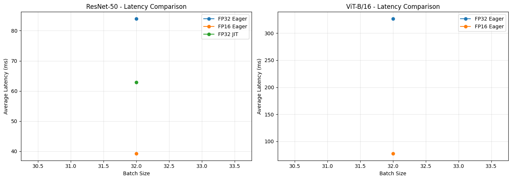
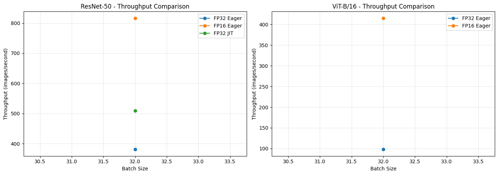

# GPU Inference Optimization Benchmark

A comprehensive benchmarking study comparing **FP32 vs FP16 mixed precision** and **TorchScript optimization** for deep learning inference on NVIDIA T4 GPU.

## 🎯 Objective

Measure the performance impact of:
- **Mixed Precision (FP16)** vs standard FP32
- **TorchScript JIT compilation** vs eager mode
- Different **batch sizes** (1, 8, 16, 32)

On two popular architectures:
- **ResNet-50** (Convolutional Neural Network)
- **Vision Transformer (ViT-B/16)** (Attention-based architecture)

---

## 📊 Key Results

### ResNet-50 @ Batch Size 32

| Configuration | Avg Latency | Throughput | Memory Usage |
|--------------|-------------|------------|--------------|
| **FP32 Eager** | 83.99 ms | 381.0 img/s | 776.5 MB |
| **FP16 Eager** | 39.19 ms | 816.4 img/s | 633.1 MB |
| **FP32 JIT** | 62.87 ms | 509.0 img/s | 780.1 MB |

**🚀 FP16 Improvements:**
- **53.3% faster** latency (84ms → 39ms)
- **2.14x throughput** increase (381 → 816 img/s)
- **18.5% memory reduction** (143 MB saved)

---

### Vision Transformer (ViT-B/16) @ Batch Size 32

| Configuration | Avg Latency | Throughput | Memory Usage |
|--------------|-------------|------------|--------------|
| **FP32 Eager** | 326.96 ms | 97.9 img/s | 779.8 MB |
| **FP16 Eager** | 77.09 ms | 415.1 img/s | 872.5 MB |

**🚀 FP16 Improvements:**
- **76.4% faster** latency (327ms → 77ms)
- **4.24x throughput** increase (98 → 415 img/s)

---

## 🔍 Key Insights

### Why ViT Benefits More from FP16 than ResNet-50?

1. **Matrix Multiplication Intensity**
   - ViT: Large attention mechanism matrices (768×768 for multi-head attention)
   - ResNet-50: Smaller 3×3 convolution kernels
   - **Tensor Cores** excel at large matrix multiplications

2. **Compute vs Memory Bound**
   - ViT: More compute-bound (benefits from FP16 compute speedup)
   - ResNet-50: More memory-bound (benefits less from Tensor Cores)

3. **Architecture Characteristics**
   - ViT: 12 transformer blocks with dense layers
   - ResNet-50: Sequential convolutions with pooling

**Conclusion:** Transformers are ideal candidates for FP16 optimization due to their attention mechanism's computational pattern.

---

## 🛠️ Technical Implementation

### Hardware & Environment
- **GPU**: NVIDIA Tesla T4 (16GB, Turing architecture)
- **Platform**: Google Colab
- **CUDA**: 12.1
- **Framework**: PyTorch 2.5.1

### Optimization Techniques

#### 1. Mixed Precision (FP16)
```python
with torch.autocast(device_type="cuda", dtype=torch.float16):
    output = model(input_tensor)
```
- Uses **Tensor Cores** for FP16 matrix multiplication
- Maintains numerical stability through automatic mixed precision
- Reduces memory bandwidth requirements

#### 2. TorchScript JIT Compilation
```python
traced_model = torch.jit.trace(model, example_input)
optimized_model = torch.jit.optimize_for_inference(traced_model)
```
- Fuses operations (Conv + BatchNorm + ReLU)
- Eliminates Python overhead
- Enables graph-level optimizations

### Benchmarking Methodology

```python
# Warmup: 10 iterations
# Timing: 100 iterations using CUDA Events
start = torch.cuda.Event(enable_timing=True)
end = torch.cuda.Event(enable_timing=True)

start.record()
with torch.inference_mode():
    output = model(input)
end.record()
torch.cuda.synchronize()

latency_ms = start.elapsed_time(end)
```

**Why CUDA Events?**
- More accurate than Python `time.time()`
- Accounts for GPU asynchronous execution
- Millisecond precision

---

## 📈 Visualizations

### Latency Comparison


### Throughput Comparison


---

## 🚀 How to Run

### Prerequisites
```bash
pip install torch torchvision timm pandas matplotlib
```

### Run Benchmark (Google Colab)
1. Open [Google Colab](https://colab.research.google.com/)
2. Set runtime to **GPU (T4)**
3. Upload `copy_of_gpu_cnn_inference.py`
4. Run all cells

### Expected Runtime
- Full benchmark (2 models × 3 configs × 4 batch sizes): ~15-20 minutes
- Quick test (1 model × 2 configs): ~5 minutes

---

## 💡 Production Recommendations

Based on these results:

1. **Use FP16 for Transformers**
   - 4x throughput improvement justifies the implementation
   - Monitor for numerical instability in edge cases

2. **TorchScript for CNNs**
   - 25% speedup on ResNet-50 with minimal code change
   - Combine with FP16 carefully (may cause issues)

3. **Batch Size Selection**
   - Larger batches (32) maximize GPU utilization
   - Trade-off with latency requirements
   - Monitor memory constraints

4. **Next Steps for Further Optimization**
   - **TensorRT**: 2-5x additional speedup
   - **ONNX Runtime**: Cross-platform deployment
   - **Dynamic Batching**: Variable batch sizes
   - **Model Distillation**: Smaller models
   - **Quantization**: INT8 for even faster inference

---

## 📁 Project Structure

```
GPU_inference/
├── README.md                          # This file
├── copy_of_gpu_cnn_inference.py       # Benchmark script
├── latency_comparison.png             # Latency visualization
├── throughput_comparison.png          # Throughput visualization
└── benchmark_results.csv              # Raw data (if available)
```

---

## 🔗 Resources

- [PyTorch Mixed Precision Docs](https://pytorch.org/docs/stable/amp.html)
- [NVIDIA Tensor Cores](https://www.nvidia.com/en-us/data-center/tensor-cores/)
- [TorchScript Guide](https://pytorch.org/docs/stable/jit.html)
- [Vision Transformers Paper](https://arxiv.org/abs/2010.11929)

---

## 📝 License

MIT License - Feel free to use for learning and interviews!

---

## 👤 Author

**Simantini Ghosh**

*Machine Learning Engineer | PyTorch | GPU Optimization*

[LinkedIn](#) | [GitHub](#) | [Portfolio](#)

---

## 🙏 Acknowledgments

- Google Colab for free GPU access
- PyTorch team for excellent tooling
- timm library for pre-trained models

